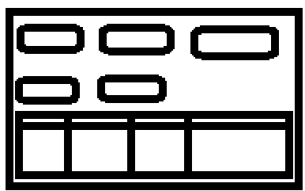
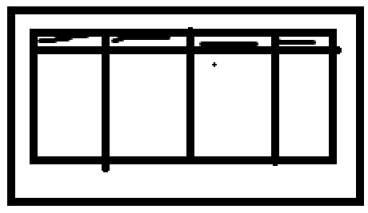
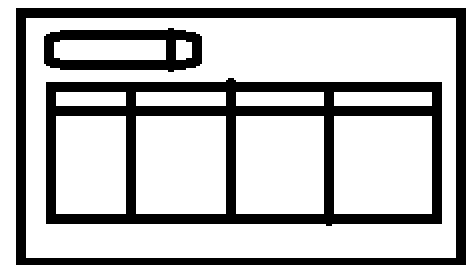
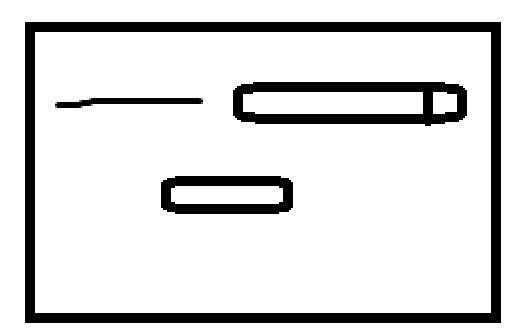
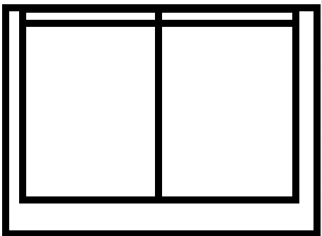
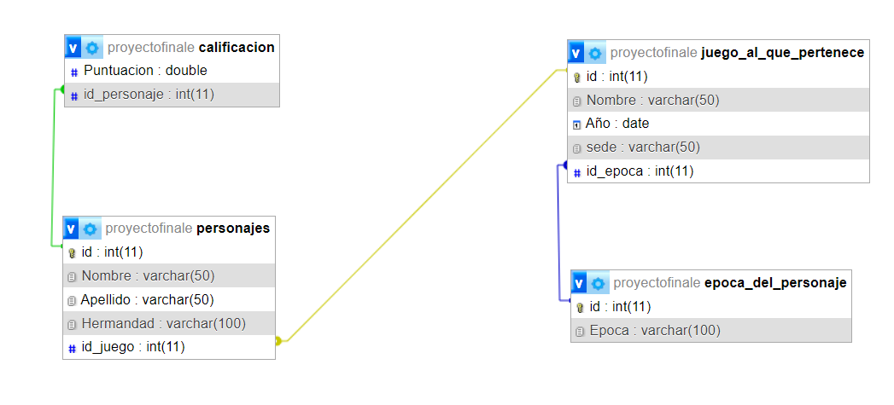
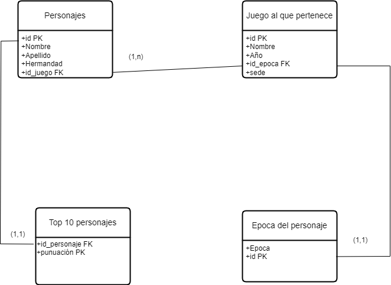

# Proyecto Final de Personajes de Assassin's Creed

Este proyecto es una aplicación de escritorio en Java que permite gestionar personajes del universo de Assassin's Creed. Utiliza Swing para la interfaz gráfica y se conecta a una base de datos MySQL para almacenar y recuperar datos. La aplicación permite:

- Ver una lista de personajes y su puntuación.
- Filtrar los personajes por puntuación.
- Ver detalles de los juegos y las épocas asociadas.
- Añadir nuevos personajes.
- Ver el top 10 de personajes por puntuación, ordenados ascendente o descendentemente.

### Pantallas Principales

#### Pantalla Principal

La pantalla principal permite navegar a las diferentes secciones de la aplicación.

#### Añadir Personaje

Pantalla para añadir un nuevo personaje a la base de datos.

#### Ver Juegos y Épocas

Pantalla que muestra los detalles de los juegos y las épocas asociadas.

#### Top 10 de Personajes

Pantalla que muestra el top 10 de personajes, con opciones para ordenar ascendentemente o descendentemente.

## Borrar Personajes

Pantalla que permite borrar personajes de la base de datos.

## Ver Epoca Individual

Pantalla que muestra las Epocas de la base de datos.

## Uso

1. **Ver Juegos y Épocas:** Muestra una lista de juegos y las épocas asociadas.
2. **Ver Top 10 de Personajes:** Muestra los 10 personajes mejor calificados, con opciones para ordenar por puntuación.
3. **Añadir Personaje:** Permite añadir un nuevo personaje a la base de datos.
4. **Eliminar Personaje:** Permite eliminar un personaje de la base de datos.
5. **Ver Época Individual:** Muestra los detalles de una época específica.

## Conexión a la Base de Datos

La aplicación se conecta a una base de datos MySQL utilizando las siguientes tablas:

- `personajes`
- `juego_al_que_pertenece`
- `epoca_del_personaje`
- `calificacion`

La estructura de estas tablas se detalla en el esquema relacional a continuación:

Esquema Relacional sacado de phpMyAdmin

Esquema Relacional hecho originalmente por mi

